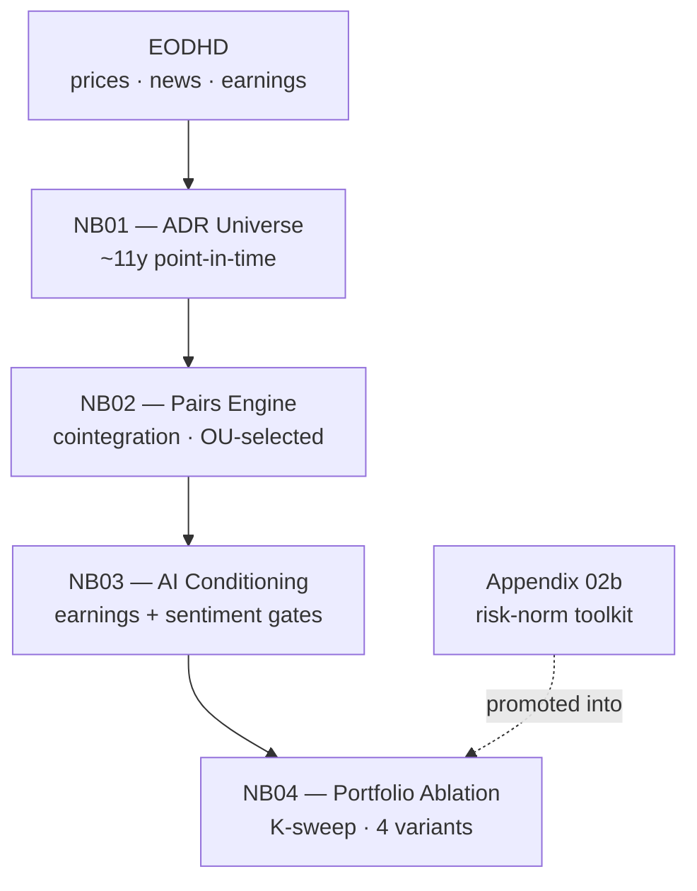

# AI-conditioned OU pairs trading on Latin American ADRs — a proof of concept

A research notebook arc that modernizes a classical pairs-trading strategy in two layers: OU mean-reversion diagnostics (Elliott 2005) to select cointegrated pairs, traded with a rolling z-score, and an AI-derived conditioning overlay — earnings calendar + news sentiment — layered on top.

## TL;DR

Across 11 years of US-listed LatAm ADRs, applying OU mean-reversion diagnostics to select pairs (traded with a rolling z-score) lifts a near-zero cointegration-only baseline (**Sharpe ≈ 0**) to **0.81**; an earnings-gate overlay carries it to **~1.05** at the principled horizon K=33 (robust across K ∈ {7…33}). A sentiment-gate overlay does not survive coverage (most names too news-thin) and signal (on the covered slice, the vendor sentiment tone slightly *reduced* risk-adjusted return). Drawing that boundary precisely — rather than claiming an edge the data cannot support — is the contribution.

## Pipeline



## Findings


*Cointegration-only selection (black, dashed) produces no tradable edge; the OU dynamics filter (grey) lifts Sharpe to 0.81; the earnings gate (blue) carries it to ~1.05 with shallower drawdowns; sentiment (orange) sits marginally below.*

| Variant | Sharpe | Note |
|---|---:|---|
| Cointegration-only | ≈ 0 | indistinguishable from zero |
| OU-selected | 0.81 | tradability comes from mean-reversion speed/cleanliness, not cointegration alone |
| OU + earnings gate | ~1.05 | at K=33 (the median holding period, used as a principled default); robust across K ∈ {7, 14, 21, 33} |
| OU + earnings + sentiment | ~1.00 | sentiment fails twice — coverage cliff + on the covered slice, vendor sentiment tone slightly *reduced* risk-adjusted return |

The sentiment boundary is the contribution: neither this signal nor this feed is fit for purpose here. Two independent levers would extend the picture — a finance-tuned tone model (FinBERT, Loughran-McDonald) replacing the vendor polarity scores on the covered slice, or a quant-grade entity-resolved feed (RavenPack, Refinitiv MarketPsych) breaking the coverage cliff.

**Design note.** We evaluated transplanting the Avellaneda & Lee (2010) S-score standardization — deviation in units of equilibrium volatility from a fitted equilibrium mean — onto the fixed-coefficient cointegration spread used here, rather than A&L's original construction of cumulative residuals from a rolling factor model. On these pairs the in-sample (μ, σ_eq) did not survive multi-year OOS: OOS spread volatility ran ~3× the IS σ_eq and the mean drifted multiple σ_eq from IS μ, saturating the signal. The fixed-coefficient transplant does not work here; the rolling z-score adapts by construction. Consistent with cointegration breakdown documented in Gatev, Goetzmann & Rouwenhorst (2006).

**Scope.** Proof of concept. Framework feasibility established; deployability not claimed.

### Limitations

- **Survivorship / point-in-time.** The ADR universe is built from a 2025-03-31 EODHD snapshot; the OOS window begins 2022-12-21. Universe membership reflects names still listed at snapshot date — delisted ADRs across the OOS window are not in the candidate set. Earnings dates and news timestamps depend on EODHD's vendor records and are not independently audited for revision history.
- **Costs.** Transaction costs of 5 bps applied to gross leg notional at every position change. Short-leg borrow, slippage beyond 5 bps, ADR-specific liquidity friction, and FX/conversion costs are not modeled. A capital-scaled allocation with realistic frictions would compress the reported Sharpes; quantifying the breakeven is identified next-step work.
- **Sentiment source.** The sentiment overlay consumes EODHD's vendor sentiment scores (polarity / pos / neg fields), not a custom model. Earlier drafts referenced VADER; that wording has been corrected.
- **Statistical inference.** Reported Sharpes are point estimates over a single OOS window. Block-bootstrap confidence intervals, Diebold-Mariano tests of equal predictive accuracy, and multiple-testing correction across K and threshold choices are not included. Lifts are described directionally; formal significance is not claimed.

## Reproducibility

The repo ships notebook code and narrative only — no rendered outputs, no vendor data. A fresh clone reads as code + prose; charts and tables materialize once you run it. Data isn't redistributed (EODHD terms of service), so reproducing the results requires your own EODHD API key.

```bash
# 1. Clone and enter
git clone https://github.com/<user>/ai-pairs-trading.git
cd ai-pairs-trading

# 2. Python env (3.11+ recommended)
python3 -m venv .venv
source .venv/bin/activate
pip install -r requirements.txt

# 3. EODHD key
echo "EODHD_API_KEY=your_key_here" > .env

# 4. Build the data snapshot (first run only)
jupyter lab notebooks/01_adr_universe.ipynb   # run all cells; populates ./data/processed/

# 5. Run the pipeline: NB02 → NB03 → NB04, in order
```

Subsequent runs of NB01 replay from the local `data/processed/` snapshot (set `OFFLINE_MODE=1` in `.env`); the EODHD key is only needed to *build* the snapshot, not to re-run downstream notebooks.

## Repo layout

```
ai-pairs-trading/
├── notebooks/
│   ├── 01_adr_universe.ipynb               # point-in-time universe & data snapshot
│   ├── 02_pairs_engine.ipynb               # cointegration → OU spread → trades
│   ├── 03_ai_conditioned_pairs.ipynb       # earnings gate + sentiment overlay
│   ├── 04_conditioned_portfolio.ipynb      # 4-variant ablation, coverage strata, K-sweep
│   └── appendix/
│       └── 02b_ou_portfolio_appendix.ipynb # risk-normalization toolkit (promoted into NB04)
├── docs/
│   └── ablation_equity.png                 # 4-variant cumulative-PnL figure (README)
├── requirements.txt
├── .gitignore
└── README.md
```

Local-only (gitignored): `data/`, `artifacts/`, `semantic_cache_v05/` — vendor data and intermediate parquets — plus `.venv/`, `.env`, and `notebooks/img/` (matplotlib figures regenerated on every NB01 run).

## References

- Araci, D. (2019). "FinBERT: Financial Sentiment Analysis with Pre-trained Language Models." *arXiv preprint* arXiv:1908.10063.
- Do, B., & Faff, R. (2010). "Does Simple Pairs Trading Still Work?" *Financial Analysts Journal*, 66(4), 83–95.
- Elliott, R. J., van der Hoek, J., & Malcolm, W. P. (2005). "Pairs Trading." *Quantitative Finance*, 5(3), 271–276.
- Gatev, E., Goetzmann, W. N., & Rouwenhorst, K. G. (2006). "Pairs Trading: Performance of a Relative-Value Arbitrage Rule." *Review of Financial Studies*, 19(3), 797–827.
- Hilpisch, Y. (forthcoming). "Python for Finance: Python Fluency in the Era of GenAI", (3rd ed.). O'Reilly Media.
- Hutto, C. J., & Gilbert, E. (2014). "VADER: A Parsimonious Rule-Based Model for Sentiment Analysis of Social Media Text." *Proceedings of the International AAAI Conference on Web and Social Media*, 8(1), 216–225.
- Loughran, T., & McDonald, B. (2011). "When Is a Liability Not a Liability? Textual Analysis, Dictionaries, and 10-Ks." *Journal of Finance*, 66(1), 35–65.
