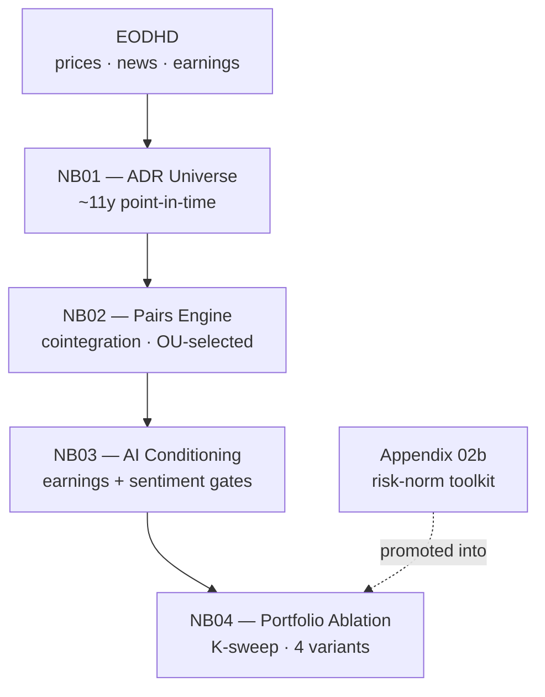
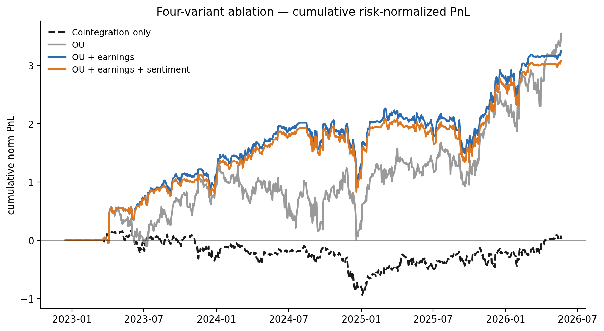

# AI-conditioned OU pairs trading on Latin American ADRs

Proof of concept. Classical pairs trading modernized in two layers: OU mean-reversion diagnostics (Elliott et al. 2005) to select cointegrated pairs, traded with a rolling z-score, plus an earnings + news-sentiment conditioning overlay. Detailed reasoning lives in the notebooks; this is the map.

**Runs from a fresh clone, no API key** — each notebook replays end-to-end on a committed snapshot.

## TL;DR

Over ~11 years of US-listed LatAm ADRs, OU pair-selection lifts a near-zero cointegration baseline (**Sharpe ≈ 0**) to **0.81**; an earnings gate carries it to **~1.05** (K=33, robust across K ∈ {7, 14, 21, 33}). A sentiment gate survives neither coverage (most names too news-thin) nor signal (on the covered slice, vendor tone slightly *reduced* risk-adjusted return). Mapping that boundary precisely is the contribution.

## Run it

[](https://colab.research.google.com/github/FranQuant/ai-pairs-trading/blob/main/notebooks/01_adr_universe.ipynb)

Open any notebook's Colab badge → **Run all**. `OFFLINE_MODE` auto-enables with no key; a committed snapshot under `data/`/`artifacts/` replays the pipeline. Locally:

```bash
git clone https://github.com/FranQuant/ai-pairs-trading.git && cd ai-pairs-trading
python3 -m venv .venv && source .venv/bin/activate && pip install -r requirements.txt
jupyter lab            # NB01 → NB02 → NB03 → NB04
```

A live `EODHD_API_KEY` in `.env` is optional — only to rebuild the snapshot (NB01), not to re-run.

## Pipeline



## Findings



| Variant | Sharpe | Note |
|---|---:|---|
| Cointegration-only | ≈ 0 | indistinguishable from zero |
| OU-selected | 0.81 | tradability is mean-reversion speed/cleanliness, not cointegration alone |
| OU + earnings | ~1.05 | K=33 (median hold); robust across K ∈ {7, 14, 21, 33} |
| OU + earnings + sentiment | ~1.00 | fails twice: coverage cliff + weak signal on the covered slice |

The earnings gate flattens a *profitable but volatile* slice — risk-normalized return falls ~18%, volatility ~37%, so Sharpe rises (jump-risk removal, not return-chasing). The sentiment result is a boundary, not an edge: neither this signal nor this feed is fit here. Next levers — a finance-tuned tone model (FinBERT, Loughran-McDonald) on the covered slice, or an entity-resolved feed (RavenPack, MarketPsych) against the coverage cliff.

**Scope.** Framework feasibility established; deployability not claimed. Key limits: 2025-03-31 snapshot (delisted ADRs absent; survivorship); 5 bps costs only (no borrow/slippage/FX); vendor sentiment, not a custom model; single-window point estimates, no formal significance tests.

## Layout

```
notebooks/   01–04 + appendix/02b
src/         config + cached EODHD client / IO
data/        committed snapshot (processed panels + static config)
artifacts/   committed NB02/NB03 outputs
docs/        ablation_equity.png
```

Gitignored: raw EODHD cache (`data/cache/`, `data/raw/`), `.venv/`, `.env`, `notebooks/img/`. The committed snapshot is the derived runnable artifact; raw vendor payloads are not redistributed.

## References

Avellaneda & Lee (2010), *Quant. Finance* 10(7) · Do & Faff (2010), *FAJ* 66(4) · Elliott, van der Hoek & Malcolm (2005), *Quant. Finance* 5(3) · Gatev, Goetzmann & Rouwenhorst (2006), *RFS* 19(3) · Hutto & Gilbert (2014), *AAAI ICWSM* 8(1) · Loughran & McDonald (2011), *J. Finance* 66(1)
