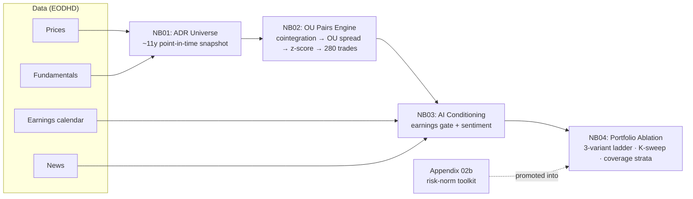

# AI-conditioned OU pairs trading on Latin American ADRs — a proof of concept

A research notebook arc that modernizes a classical pairs-trading strategy in two layers: continuous-time OU spread modeling (Elliott 2005) over Gatev-style distance pairs, and an AI-derived conditioning overlay — earnings calendar + news sentiment — layered on top.

## TL;DR

Across an 11-year point-in-time backtest on US-listed Latin American ADRs, the earnings-gate overlay lifts portfolio Sharpe from 0.72 (unconditioned OU baseline) to ~1.00 at the principled horizon K=33, and the lift is robust across K ∈ {7, 14, 21, 33} — a stable risk-reduction feature of the strategy, not a knife-edge at one parameter. The sentiment-gate overlay, by contrast, is bounded twice over: by coverage (most names lack enough as-of news to form a view) and by signal (on the covered slice where the gate could see, it slightly hurt risk-adjusted return). Drawing that boundary precisely — rather than claiming an edge the data cannot support — is the contribution.

## Pipeline



## Findings

**The earnings gate is the substance, and it is robust.** Flattening trades that would be held through a scheduled earnings report removes a slice of the book that was close to break-even in return but carried real jump risk: cost in return is small, cut in volatility, drawdown, and left-tail severity is large. Sharpe moves from 0.72 to ~1.00 at the median-hold horizon (K=33), with the full band K ∈ {7…33} comfortably above the unconditioned baseline; the benefit collapses only at K=56, where the gate over-blocks two-thirds of the book. K was fixed at the median holding period on principle, before any of these numbers were seen, and deliberately left there rather than slid to the in-sample peak (~K=21). The value of the sweep is the *shape* of the response, not a licence to pick the winner.

**The sentiment gate is bounded twice over, and the boundary is the result.** First by coverage: for most of this universe there is too little news, as-of entry, to form a view, so the gate abstains and barely moves the portfolio. Second — and more telling — by signal: on the *covered* slice, where the gate can see, downsizing on adverse VADER-style tone slightly *reduced* risk-adjusted return rather than improving it across the handful of trades it touched. So the limit is not only that the news is thin; it is that the tone signal, as available here, did not single out the trades worth shrinking. That distinction shapes what would extend the picture — a domain-tuned tone model (Loughran-McDonald, FinBERT) on the covered slice, or a quant-grade entity-resolved feed (RavenPack, Refinitiv MarketPsych, Bloomberg) to lift coverage on the thin names — two independent levers, not one.

**Scope.** This is a proof of concept. The results substantiate the framework's feasibility and identify precisely where the next data investment would pay off; they do not claim a deployable strategy. What belongs to a later stage: a true capital-scaled allocation (per-pair notional reconstructed from prices), an explicit stop-loss, broader and more specialized sentiment sourcing, and deeper shock-window analysis around scheduled events.

## Reproducibility

The repo ships notebook code and narrative only — no rendered outputs, no vendor data. A fresh clone reads as code + prose; charts and tables materialize once you run it. Data isn't redistributed (EODHD terms of service), so reproducing the results requires your own EODHD API key.

```bash
# 1. Clone and enter
git clone https://github.com/<user>/ai-pairs-trading.git
cd ai-pairs-trading

# 2. Python env (3.11+ recommended)
python3 -m venv .venv
source .venv/bin/activate
pip install -r requirements.txt

# 3. EODHD key
echo "EODHD_API_KEY=your_key_here" > .env

# 4. Build the data snapshot (first run only)
jupyter lab notebooks/01_adr_universe.ipynb   # run all cells; populates ./data/processed/

# 5. Run the pipeline: NB02 → NB03 → NB04, in order
```

Subsequent runs of NB01 replay from the local `data/processed/` snapshot (set `OFFLINE_MODE=1` in `.env`); the EODHD key is only needed to *build* the snapshot, not to re-run downstream notebooks.

## Repo layout

```
ai-pairs-trading/
├── notebooks/
│   ├── 01_adr_universe.ipynb               # point-in-time universe & data snapshot
│   ├── 02_pairs_engine.ipynb               # cointegration → OU spread → trades
│   ├── 03_ai_conditioned_pairs.ipynb       # earnings gate + sentiment overlay
│   ├── 04_conditioned_portfolio.ipynb      # 3-variant ablation, coverage strata, K-sweep
│   └── appendix/
│       └── 02b_ou_portfolio_appendix.ipynb # risk-normalization toolkit (promoted into NB04)
├── requirements.txt
├── .gitignore
└── README.md
```

Local-only (gitignored): `data/`, `artifacts/`, `semantic_cache_v05/` — vendor data and intermediate parquets — plus `.venv/`, `.env`, and `notebooks/img/` (matplotlib figures regenerated on every NB01 run).

## References

- Araci, D. (2019). "FinBERT: Financial Sentiment Analysis with Pre-trained Language Models." *arXiv preprint* arXiv:1908.10063.
- Do, B., & Faff, R. (2010). "Does Simple Pairs Trading Still Work?" *Financial Analysts Journal*, 66(4), 83–95.
- Elliott, R. J., van der Hoek, J., & Malcolm, W. P. (2005). "Pairs Trading." *Quantitative Finance*, 5(3), 271–276.
- Gatev, E., Goetzmann, W. N., & Rouwenhorst, K. G. (2006). "Pairs Trading: Performance of a Relative-Value Arbitrage Rule." *Review of Financial Studies*, 19(3), 797–827.
- Hutto, C. J., & Gilbert, E. (2014). "VADER: A Parsimonious Rule-Based Model for Sentiment Analysis of Social Media Text." *Proceedings of the International AAAI Conference on Web and Social Media*, 8(1), 216–225.
- Loughran, T., & McDonald, B. (2011). "When Is a Liability Not a Liability? Textual Analysis, Dictionaries, and 10-Ks." *Journal of Finance*, 66(1), 35–65.
