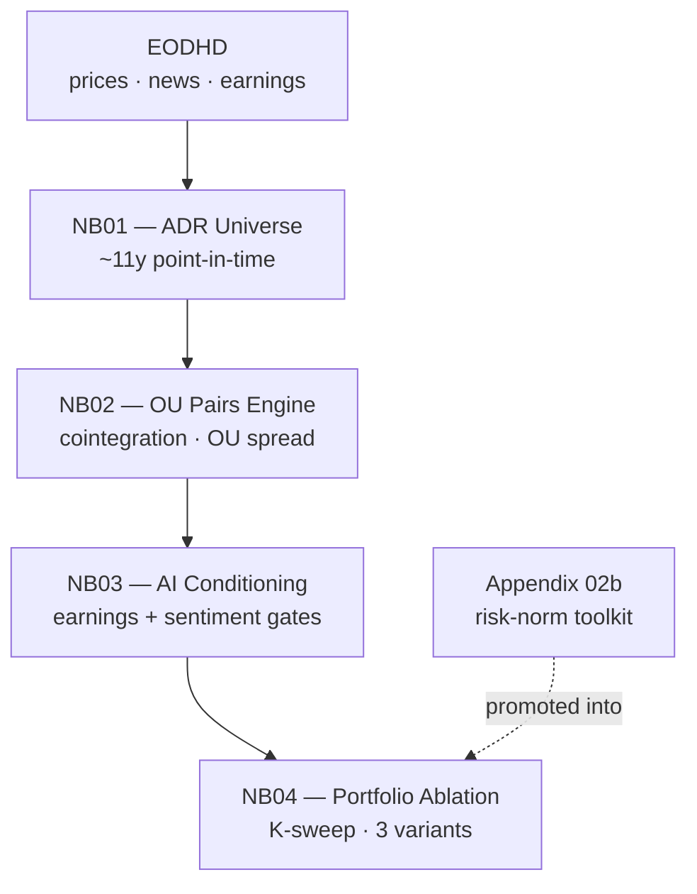

# AI-conditioned OU pairs trading on Latin American ADRs — a proof of concept

A research notebook arc that modernizes a classical pairs-trading strategy in two layers: continuous-time OU spread modeling (Elliott 2005) over Gatev-style distance pairs, and an AI-derived conditioning overlay — earnings calendar + news sentiment — layered on top.

## TL;DR

Across 11 years of US-listed LatAm ADRs, an earnings-gate overlay on a Gatev/OU pairs book lifts Sharpe from **0.72 → ~1.00** at the principled horizon K=33, robust across K ∈ {7…33}. A sentiment-gate overlay does not survive coverage (most names too news-thin) and signal (on the covered slice, VADER tone slightly *reduced* risk-adjusted return). Drawing that boundary precisely — rather than claiming an edge the data cannot support — is the contribution.

## Pipeline



## Findings

**Earnings gate — the substance, robust.** Flattening trades held through scheduled reports cuts jump risk on a slice of the book that was close to break-even in return.

- **Sharpe lifts from 0.72 to ~1.00** at K=33 (the median holding period, fixed before any of these numbers were seen)
- Robust across K ∈ {7, 14, 21, 33} — the benefit lives in drawdown, skew, and left-tail severity, not headline return
- The in-sample peak (~K=21, Sharpe 1.29) was deliberately not chased; the *shape* of the sweep is the result, not the maximum

**Sentiment gate — bounded twice over, and the boundary is the result.**

- *Coverage*: most names lack enough as-of news for the gate to form a view; it abstains and the portfolio barely moves
- *Signal*: on the covered slice — where the gate can see — VADER-style tone slightly *reduced* risk-adjusted return rather than improving it

The implication is precise: neither this lexicon nor this feed is fit for purpose here. Two independent levers would extend the picture — a finance-tuned tone model (Loughran-McDonald, FinBERT) on the covered slice, or a quant-grade entity-resolved feed (RavenPack, Refinitiv MarketPsych, Bloomberg) to break the coverage cliff.

**Scope.** Proof of concept. The framework's feasibility is established and the next data investment is identified; deployability is not claimed. Later stages: true capital-scaled allocation (per-pair notional reconstructed from prices), explicit stop-loss, broader and more specialized sentiment sourcing, and shock-window analysis around scheduled events.

## Reproducibility

The repo ships notebook code and narrative only — no rendered outputs, no vendor data. A fresh clone reads as code + prose; charts and tables materialize once you run it. Data isn't redistributed (EODHD terms of service), so reproducing the results requires your own EODHD API key.

```bash
# 1. Clone and enter
git clone https://github.com/<user>/ai-pairs-trading.git
cd ai-pairs-trading

# 2. Python env (3.11+ recommended)
python3 -m venv .venv
source .venv/bin/activate
pip install -r requirements.txt

# 3. EODHD key
echo "EODHD_API_KEY=your_key_here" > .env

# 4. Build the data snapshot (first run only)
jupyter lab notebooks/01_adr_universe.ipynb   # run all cells; populates ./data/processed/

# 5. Run the pipeline: NB02 → NB03 → NB04, in order
```

Subsequent runs of NB01 replay from the local `data/processed/` snapshot (set `OFFLINE_MODE=1` in `.env`); the EODHD key is only needed to *build* the snapshot, not to re-run downstream notebooks.

## Repo layout

```
ai-pairs-trading/
├── notebooks/
│   ├── 01_adr_universe.ipynb               # point-in-time universe & data snapshot
│   ├── 02_pairs_engine.ipynb               # cointegration → OU spread → trades
│   ├── 03_ai_conditioned_pairs.ipynb       # earnings gate + sentiment overlay
│   ├── 04_conditioned_portfolio.ipynb      # 3-variant ablation, coverage strata, K-sweep
│   └── appendix/
│       └── 02b_ou_portfolio_appendix.ipynb # risk-normalization toolkit (promoted into NB04)
├── requirements.txt
├── .gitignore
└── README.md
```

Local-only (gitignored): `data/`, `artifacts/`, `semantic_cache_v05/` — vendor data and intermediate parquets — plus `.venv/`, `.env`, and `notebooks/img/` (matplotlib figures regenerated on every NB01 run).

## References

- Araci, D. (2019). "FinBERT: Financial Sentiment Analysis with Pre-trained Language Models." *arXiv preprint* arXiv:1908.10063.
- Do, B., & Faff, R. (2010). "Does Simple Pairs Trading Still Work?" *Financial Analysts Journal*, 66(4), 83–95.
- Elliott, R. J., van der Hoek, J., & Malcolm, W. P. (2005). "Pairs Trading." *Quantitative Finance*, 5(3), 271–276.
- Gatev, E., Goetzmann, W. N., & Rouwenhorst, K. G. (2006). "Pairs Trading: Performance of a Relative-Value Arbitrage Rule." *Review of Financial Studies*, 19(3), 797–827.
- Hutto, C. J., & Gilbert, E. (2014). "VADER: A Parsimonious Rule-Based Model for Sentiment Analysis of Social Media Text." *Proceedings of the International AAAI Conference on Web and Social Media*, 8(1), 216–225.
- Loughran, T., & McDonald, B. (2011). "When Is a Liability Not a Liability? Textual Analysis, Dictionaries, and 10-Ks." *Journal of Finance*, 66(1), 35–65.
